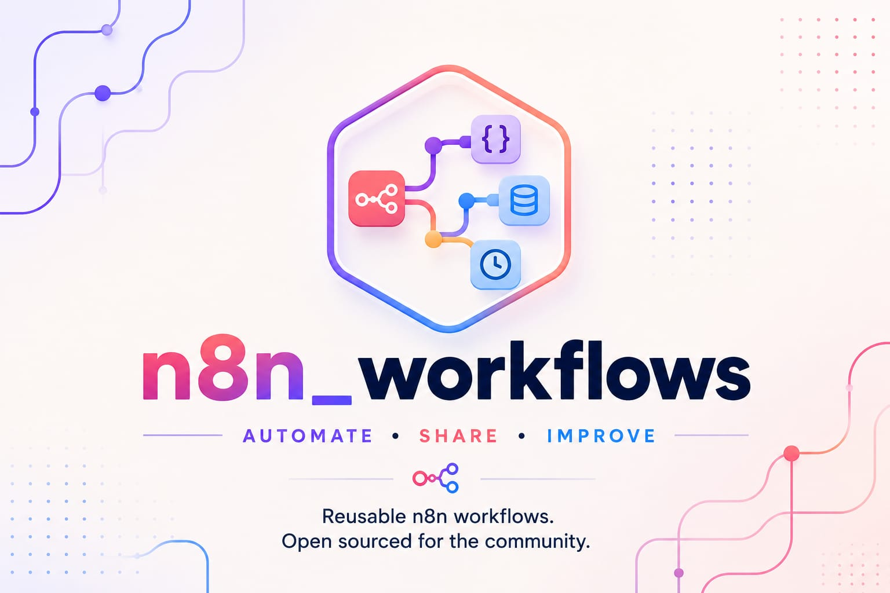

<div align="center">



# n8n Workflows

**Community-driven collection of reusable n8n workflows**

Build • Share • Improve

</div>

A growing, open-source collection of practical n8n workflows — built, tested, and used in real projects, then published here for anyone to import and adapt.

Every workflow ships as a ready-to-import `.json` file plus its own short README covering what it does, what it needs, and how to set it up.

---

## 📂 Repository Structure

```
n8n_workflows/
├── workflows/
│   ├── github-debugger-agent/
│   │   ├── workflow.json
│   │   └── README.md
│   ├── telegram-github-antigravity-pipeline/
│   │   ├── workflow.json
│   │   └── README.md
│   ├── duplicate-issue-detector/
│   │   ├── workflow.json
│   │   └── README.md
│   ├── competitor-feature-parity-watcher/
│   │   ├── workflow.json
│   │   └── README.md
│   └── <next-workflow>/
│       ├── workflow.json
│       └── README.md
├── LICENSE
├── CONTRIBUTING.md
└── README.md   ← you are here
```

Each workflow lives in its own folder under `workflows/`, so the collection can grow indefinitely without the root becoming cluttered.

---

## 🗂️ Workflow Index

| Workflow | Description | Stack |
|---|---|---|
| [GitHub Debugger Agent](./workflows/github-debugger-agent) | Scans a repo for bugs/inefficiencies with an LLM, reports to Discord, fixes only on approval | n8n, OpenAI/GPT-4o, GitHub API, Discord |
| [Telegram → GitHub → Antigravity Pipeline](./workflows/telegram-github-antigravity-pipeline) | Message an issue number on Telegram; a local LLM reasons about it, Antigravity codes the fix, you approve, it pushes | n8n, Ollama/llama.cpp, GitHub API, Antigravity CLI, Telegram 
| [Semantic Duplicate Issue Detector](./workflows/duplicate-issue-detector) | Flags likely-duplicate GitHub issues using semantic similarity, comments with the match — never closes/labels without review | n8n, OpenAI Embeddings, Qdrant, GitHub API |
| [Competitor Feature-Parity Watcher](./workflows/competitor-feature-parity-watcher) | Watches competitor changelogs weekly; an LLM scores relevance against your own feature list, filtering signal from noise | n8n, OpenRouter, Google Sheets, RSS |

*(New workflows are added regularly — see [Roadmap](#-roadmap) below or watch this repo for updates.)*

---

## 🧠 Philosophy

Every workflow here follows the same core principle: **human-in-the-loop by default.** None of them auto-commit, auto-merge, or take irreversible action without an explicit approval step from a real person. Automation should remove the tedious part of the work, not the judgment.

---

## 🚀 Getting Started

**Prerequisites (common to most workflows in this repo):**
- An n8n instance — self-hosted (Docker) or n8n Cloud (v1.28+ recommended for native Ollama support)
- Git and a GitHub account, with a fine-grained Personal Access Token scoped to the specific repo you're automating
- Any workflow-specific requirements — see that workflow's own README (LLM provider, messaging platform, etc.)

**To use any workflow:**
1. Open the workflow's folder under `workflows/`
2. Read its README for exact prerequisites and setup steps
3. In n8n: **Workflows → Import from File**, select that workflow's `workflow.json`
4. Fill in the credentials and placeholder values called out in its README
5. Test on a throwaway/sandbox repo before pointing it at anything important

---

## 🤝 Contributing

Contributions are welcome — new workflows, fixes to existing ones, or clearer documentation. See [CONTRIBUTING.md](./CONTRIBUTING.md) for the process. In short:
1. Fork the repo
2. Add your workflow under `workflows/<your-workflow-name>/`, including a `workflow.json` and a `README.md` describing it
3. Open a pull request

If your workflow handles credentials, tokens, or personal data anywhere in its JSON, scrub them and replace with placeholders (e.g. `REPLACE_ME`) before committing — see the [Security Note](#-security-note) below.

---

## 🔒 Security Note

n8n exports can embed credential *references* but not raw secrets by default — still, always double-check your exported JSON before committing. Never commit:
- API keys, tokens, or webhook secrets
- Real chat IDs, user IDs, or email addresses
- Real repo names/paths if they reveal something private

Use placeholder values (`REPLACE_ME`, `YOUR_CHAT_ID`, etc.) in anything published here.

---

## 📄 License

Distributed under the MIT License — see [LICENSE](./LICENSE) for details. You're free to use, modify, and redistribute any workflow here, including commercially, with attribution.

---
## 🙌 Want to Contribute?
Check the [open issues](../../issues) labeled `good first issue` or
`help wanted` — pick one, and see [CONTRIBUTING.md](./CONTRIBUTING.md)
for the branch → PR → review process.

Built and maintained by [Shinjan Das](https://github.com/Skull-boy) — issues and PRs welcome.
