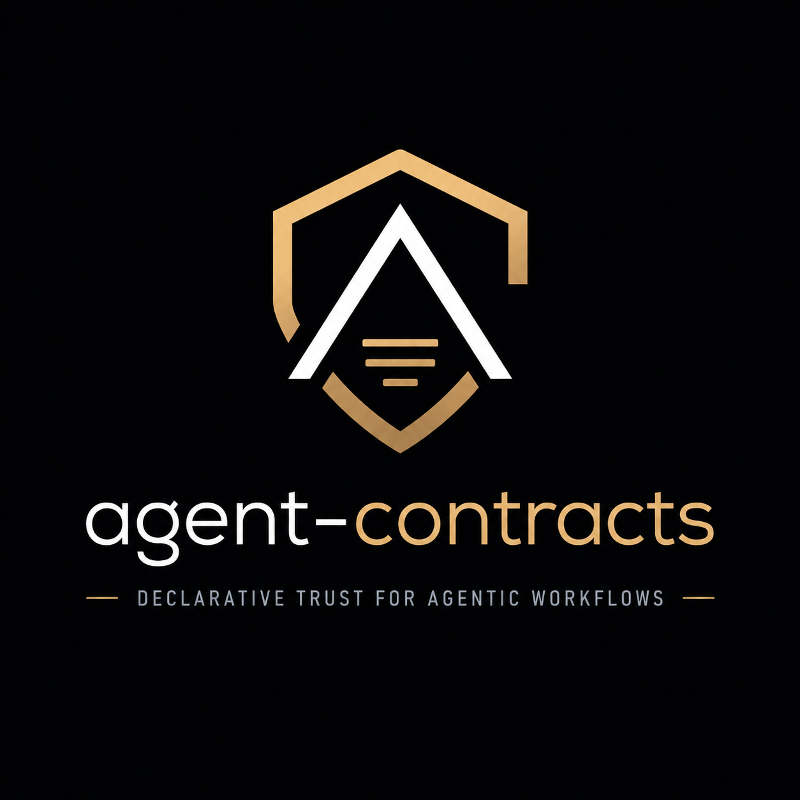

<div align="center">



# agent-contracts

**Portable contracts for agentic workflows — permissions, side effects, approval boundaries, recovery, and execution guarantees.**

MCP and A2A are standardizing how agents interact with tools and with each other. agent-contracts explores the layer above that: what an agent is allowed to do, what requires approval, what side effects it may create, and what should happen when execution fails.


</div>

This repository is organized around a documented set of reusable automation **patterns**, each with a framework-agnostic specification and a **Contract** declaring exactly what a given implementation is allowed to do — its permissions, side effects, approval points, and recovery behavior. Read [`docs/workflow-engineering.md`](./docs/workflow-engineering.md) for the full reasoning, and [`WORKFLOW-CONTRACT-SPEC.md`](./WORKFLOW-CONTRACT-SPEC.md) for the spec itself. n8n is the first implementation, not the identity — Make, LangGraph, LangChain, or anything that comes after are equally valid targets for the same Contract.

> **Contract rollout status:** newly added workflows ship with a full Contract from day one. Earlier workflows are being migrated to the same format — check a given workflow's own README for its current status, and see [open issues](../../issues) if you'd like to help close the gap on an older one.

---

## 🧩 What This Actually Is

The n8n workflow is the *implementation*, not the point. What's actually reusable is the pattern underneath it — `fetch → classify → route → notify`, or `detect → judge → approve → act` — the same shape whether it's built in n8n, LangGraph, or something that doesn't exist yet.

Every workflow here documents that pattern explicitly, so the ideas are portable even if you never touch n8n. This came directly out of a [community discussion](https://www.reddit.com/r/AI_Agents/comments/1v6dny2/) where several people independently converged on the same conclusion: the missing piece in agentic automation isn't more agents, it's a shared, checkable contract for what they're allowed to do.

---

## 📋 Every Workflow Documents a Contract

Instead of just a prose README, each workflow's documentation includes:

- **Inputs** — what data goes in
- **Permissions Required** — exactly what it can read/write, nothing implied
- **Side Effects** — every action it can take, explicitly listed
- **Approval Points** — where a human has to say yes before anything irreversible happens
- **Recovery Behavior** — what it does when a dependency fails, instead of failing silently

This is what "human-in-the-loop by default" actually means in practice — not a slogan, a checkable spec per workflow.

---

## 📂 Repository Structure

```
agent-contracts/
├── README.md
├── WORKFLOW-CONTRACT-SPEC.md
├── CONTRIBUTING.md
├── CONTRIBUTORS.md
├── LICENSE
├── docs/
│   ├── workflow-engineering.md
│   ├── architecture.md
│   └── concepts/
│       ├── permissions.md
│       ├── side-effects.md
│       ├── approval-boundaries.md
│       ├── replay-semantics.md
│       └── recovery.md
├── patterns/
│   └── detect-judge-approve-act.md      ← docs only, links out to implementations
├── implementations/
│   └── n8n/
│       ├── duplicate-issue-detector/
│       │   ├── workflow.json
│       │   ├── contract.yaml            ← contract stays here, per-implementation
│       │   └── README.md
│       └── ...
└── rfcs/
    └── 0001-contract-model.md            ← permanent record, once something's decided
```

Each workflow lives in its own folder under `workflows/`, so the collection can grow indefinitely without the root becoming cluttered.

---

## 🗂️ Workflow Index

| Workflow | Description | Stack |
|---|---|---|
| [GitHub Debugger Agent](./workflows/github-debugger-agent) | Scans a repo for bugs/inefficiencies with an LLM, reports to Discord, fixes only on approval | n8n, OpenAI/GPT-4o, GitHub API, Discord |
| [Telegram → GitHub → Antigravity Pipeline](./workflows/telegram-github-antigravity-pipeline) | Message an issue number on Telegram; a local LLM reasons about it, Antigravity codes the fix, you approve, it pushes | n8n, Ollama/llama.cpp, GitHub API, Antigravity CLI, Telegram |
| [Semantic Duplicate Issue Detector](./workflows/duplicate-issue-detector) | Flags likely-duplicate GitHub issues using semantic similarity, comments with the match — never closes/labels without review | n8n, OpenAI Embeddings, Qdrant, GitHub API |
| [Competitor Feature-Parity Watcher](./workflows/competitor-feature-parity-watcher) | Watches competitor changelogs weekly; an LLM scores relevance (with debuggable reason codes) against your own feature list | n8n, OpenRouter, Google Sheets, RSS |
| [Job Application Silent-Rejection Detector](./workflows/job-application-silent-rejection-detector) | Watches postings you've applied to for status changes — a real signal instead of indefinite silence | n8n, OpenRouter, Google Sheets |
| [Telegram Structured Solver → PDF](./workflows/telegram-structured-solver-pdf) | Message an assignment to a bot; an agent solves it step-by-step in strict JSON with a self-correcting retry loop, returns a formatted PDF | n8n, OpenAI, Telegram, PDFShift |

*(New workflows are added regularly — see [open issues](../../issues) or watch this repo for updates.)*

---

## 🧠 Philosophy

Every workflow here follows the same core principle: **human-in-the-loop by default.** None of them auto-commit, auto-merge, or take irreversible action without an explicit approval step from a real person. Automation should remove the tedious part of the work, not the judgment.

---

## 🚀 Getting Started

**Prerequisites (common to most workflows in this repo):**
- An n8n instance — self-hosted (Docker) or n8n Cloud (v1.28+ recommended for native Ollama support)
- Git and a GitHub account, with a fine-grained Personal Access Token scoped to the specific repo you're automating
- Any workflow-specific requirements — see that workflow's own README (LLM provider, messaging platform, etc.)

**To use any workflow:**
1. Open the workflow's folder under `workflows/`
2. Read its README for its Contract, prerequisites, and setup steps
3. In n8n: **Workflows → Import from File**, select that workflow's `workflow.json`
4. Fill in the credentials and placeholder values called out in its README
5. Test on a throwaway/sandbox repo before pointing it at anything important

---

## 🔐 Before You Import Any Workflow — Check This First

Workflow files can embed logic that touches credentials, files, and external services. Before importing anything from this repo (or anywhere else):

- [ ] Open the raw `workflow.json` and skim every `httpRequest` node's URL — does every destination make sense for what the workflow claims to do?
- [ ] Check every node with a credential attached — does it request only the permissions its Contract says it needs?
- [ ] Look for anything that sends data to an unfamiliar or unexplained external domain
- [ ] Never import a workflow that asks for broader credential scope than its stated Contract requires

This applies to every workflow in this repo too — if you spot something that doesn't match its documented Contract, please open an issue.

---

## 🤝 Contributing

Contributions are welcome — new workflows, fixes to existing ones, clearer documentation, or a Contract block for a workflow that doesn't have one yet. See [CONTRIBUTING.md](./CONTRIBUTING.md) for the full process. In short:

1. Fork the repo
2. Add your workflow under `workflows/<your-workflow-name>/`, including a `workflow.json` and a `README.md` with a Contract section
3. Open a pull request — branch off `main`, never commit directly to it
4. Check the [open issues](../../issues) tagged `good first issue` or `help wanted` if you're not sure where to start

If your workflow handles credentials, tokens, or personal data anywhere in its JSON, scrub them and replace with placeholders (e.g. `REPLACE_ME`) before committing — see the [Security Note](#-security-note) below.

Everyone who contributes code or meaningfully shapes this project through discussion is credited in [CONTRIBUTORS.md](./CONTRIBUTORS.md).

---

## 🔒 Security Note

n8n exports can embed credential *references* but not raw secrets by default — still, always double-check your exported JSON before committing. Never commit:
- API keys, tokens, or webhook secrets
- Real chat IDs, user IDs, or email addresses
- Real repo names/paths if they reveal something private

Use placeholder values (`REPLACE_ME`, `YOUR_CHAT_ID`, etc.) in anything published here.

---

## 📄 License

Distributed under the MIT License — see [LICENSE](./LICENSE) for details. You're free to use, modify, and redistribute any workflow here, including commercially, with attribution.

---

Built and maintained by [Shinjan Das](https://github.com/Skull-boy) — see [CONTRIBUTORS.md](./CONTRIBUTORS.md) for everyone who's helped shape it. Issues and PRs welcome.
